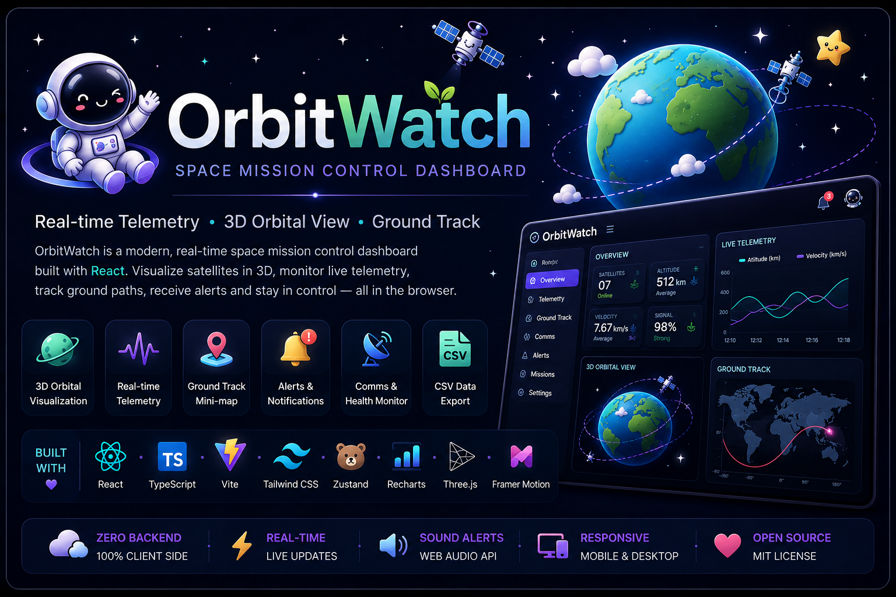
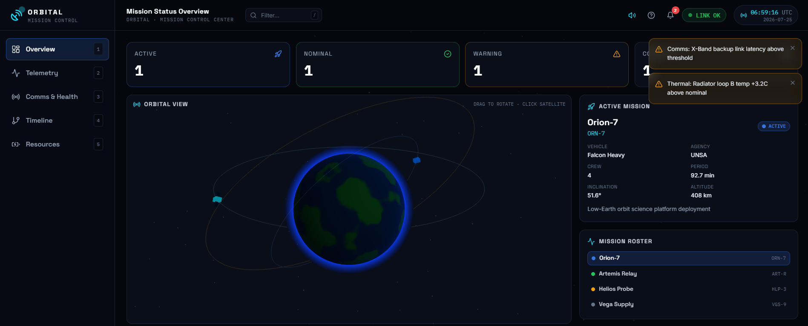
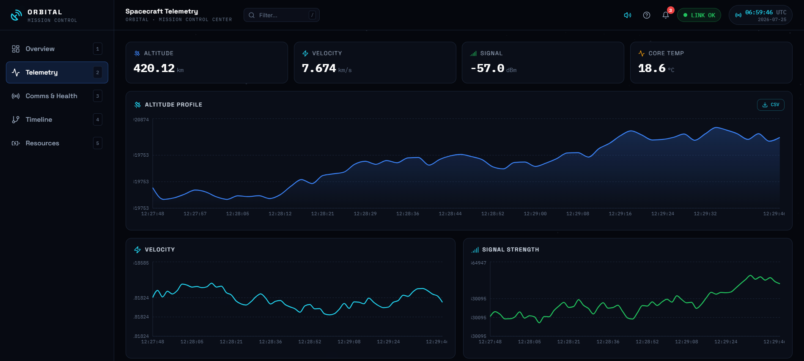
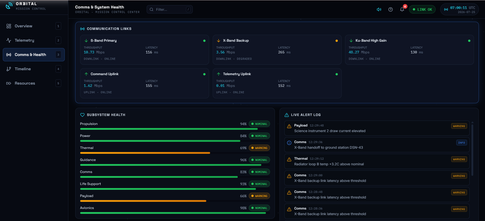
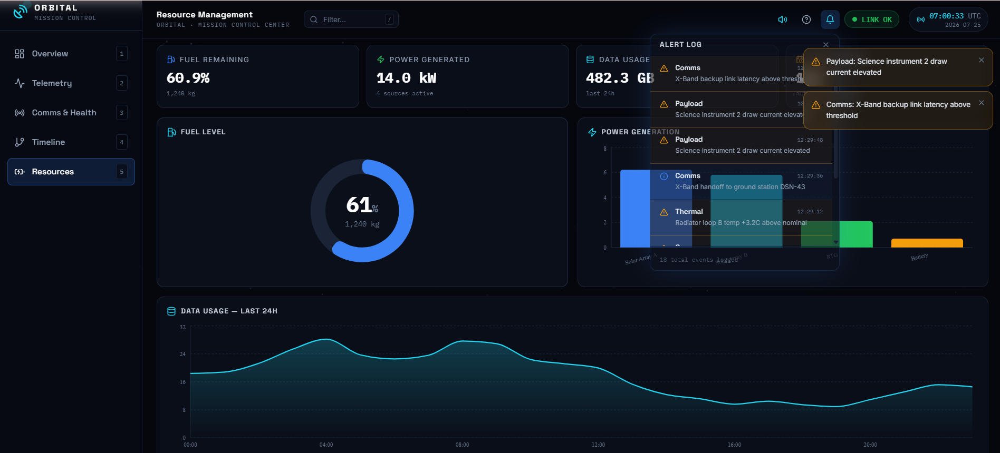

<div align="center">



# 🛰️ OrbitWatch

### Orbital Space Mission Control Dashboard

**React Three Fiber 3D · Real-time telemetry · Ground track · Full observability UI · Zero backend**

<br>


<br>


<br>


<br>


<br><br>

[**Overview**](#-overview) · [**Features**](#-features) · [**Architecture**](#️-architecture) · [**Tech Stack**](#️-tech-stack) · [**Quick Start**](#-quick-start) · [**Screens**](#-screenshots) · [**Roadmap**](#-roadmap)

</div>

---

## ✔ Key Achievements

<div align="center">

| | | |
|---|---|---|
| ✔ Live 3D Orbital Visualization | ✔ Real-time Telemetry Charts | ✔ SVG Ground Track Mini-map |
| ✔ Notification Bell + Unread Badge | ✔ Web Audio Alert Sounds | ✔ Search Filtering Across All Tabs |
| ✔ CSV Telemetry Export | ✔ Clickable Mission Roster | ✔ Zero External Dependencies for Data |

</div>

---

## 🤔 Why ORBITAL?

Most React dashboards render a static data table. **ORBITAL demonstrates the complete mission control experience:**

```
  3D Globe
     ↓
 Live Telemetry
     ↓
 Ground Track
     ↓
 Alert System
     ↓
 Sound + Notifs
     ↓
 Comms & Health
     ↓
 CSV Export
```

Every panel is wired to a shared live-data simulation engine — state updates propagate from the Zustand store through Recharts, React Three Fiber, and the SVG ground track simultaneously, with no backend and no stale mocks.

---

## 📋 Table of Contents

- [Key Achievements](#-key-achievements)
- [Why ORBITAL?](#-why-orbital)
- [Overview](#-overview)
- [Screenshots](#-screenshots)
- [Features](#-features)
- [Architecture](#️-architecture)
- [Tech Stack](#️-tech-stack)
- [Project Structure](#-project-structure)
- [Quick Start](#-quick-start)
- [Tab Reference](#-tab-reference)
- [Keyboard Shortcuts](#-keyboard-shortcuts)
- [Sound System](#-sound-system)
- [Ground Track](#-ground-track)
- [CSV Export](#-csv-export)
- [Roadmap](#-roadmap)
- [Author](#-author)

---

## 🌟 Overview

**ORBITAL** is a production-quality space mission control dashboard built entirely in the browser. It pairs a live-simulated telemetry engine with a **React Three Fiber** 3D orbital globe, tabbed mission panels, real-time Recharts graphs, a Web Audio alert system, and an SVG equirectangular ground track — all wired through a single **Zustand** store that drives live updates across every component simultaneously.

There is no backend. The simulation engine generates satellite telemetry, subsystem health, communication link status, alerts, and orbital position data client-side — updating every 2–4 seconds — so the dashboard behaves exactly as it would against a real telemetry stream.

> This is not a static prototype. It is the operational UI layer of a mission control system: live data propagation, audible alert escalation, exportable records, and a 3D orbital view — all from a single `npm run dev`.

---

## 📸 Screenshots

<div align="center">

### 3D Orbital View — Overview Tab


<br><br>

### Real-time Telemetry Charts + Ground Track


<br><br>

### Comms & System Health Panel


<br><br>

### Notification Bell + Alert Dropdown


</div>

---

## ✨ Features

<table>
<tr>
<td width="50%" valign="top">

**🌍 3D Orbital Visualization**
- Interactive WebGL globe via React Three Fiber
- Multiple satellite objects with live orbital motion
- Click any satellite to select it and sync the mission roster
- Drag to rotate, scroll to zoom

</td>
<td width="50%" valign="top">

**📡 Live Telemetry Engine**
- Simulated data ticks every 2–4 seconds across all panels
- Altitude, velocity, signal strength, power, temperature
- Latitude / longitude position tracking
- Scrollable live feed with timestamped readouts

</td>
</tr>
<tr>
<td width="50%" valign="top">

**🗺️ SVG Ground Track Mini-map**
- Equirectangular world projection, zero dependencies
- Plots full lat/lon telemetry path as a trail
- Crosshair marker at current position
- Inclination band overlay and grid lines

</td>
<td width="50%" valign="top">

**🔔 Notification System**
- Bell icon with live unread badge counter
- Animated dropdown showing last 8 alerts
- Severity color coding: info / warning / critical
- Closes on outside click

</td>
</tr>
<tr>
<td width="50%" valign="top">

**🔊 Web Audio Alert Sounds**
- Toggle sound on/off from the header
- Synthesized beep using Web Audio API — no audio files
- Single pip for warnings, double pip for critical
- Respects mute state stored in Zustand

</td>
<td width="50%" valign="top">

**🔍 Real Search Filtering**
- Global search bar in the header (shortcut: `/`)
- Filters mission roster, comms links, and alert log live
- Zero-results states with contextual messaging
- Result count shown in panel headers

</td>
</tr>
<tr>
<td width="50%" valign="top">

**📥 CSV Telemetry Export**
- One-click export from the Telemetry tab
- Exports full in-memory telemetry history
- Columns: time, altitude, velocity, signal, power, temp, lat, lon
- Browser download — no server round-trip

</td>
<td width="50%" valign="top">

**🚀 Clickable Mission Roster**
- Each mission row is a button that sets the active mission
- Syncs the 3D satellite selection in the orbital view
- Filtered by the global search query
- Highlight ring on the currently selected mission

</td>
</tr>
</table>

---

## 🏗️ Architecture

```
                    ┌───────────────────┐
                    │    Zustand Store  │
                    │  (single source   │
                    │    of truth)      │
                    └────────┬──────────┘
                             │ reactive state
          ┌──────────────────┼──────────────────┐
          ▼                  ▼                  ▼
   ┌─────────────┐   ┌──────────────┐   ┌──────────────┐
   │  Simulation │   │   Tab Views  │   │   UI Layer   │
   │   Engine    │   │  (Overview / │   │  (Header /   │
   │  (tickers)  │   │  Telemetry / │   │  Sidebar /   │
   └──────┬──────┘   │  Comms / ... │   │  Notif Bell) │
          │          └──────┬───────┘   └──────┬───────┘
          │                 │                  │
          ▼                 ▼                  ▼
   ┌─────────────┐   ┌──────────────┐   ┌──────────────┐
   │  Alert &    │   │ React Three  │   │  Web Audio   │
   │  Toast Push │   │  Fiber (3D)  │   │  API (beeps) │
   └─────────────┘   │  + Recharts  │   └──────────────┘
                     │  + SVG Track │
                     └──────────────┘
```

**Data flow:** interval-based tickers in `useStore` push new telemetry points, subsystem values, comms link states, and alerts into Zustand on independent schedules (2 s / 3 s / 2.5 s / 4 s). Every subscribed component re-renders only its slice of state. The 3D scene, charts, and ground track all read from the same store — no prop drilling, no context providers, no API calls.

---

## 🛠️ Tech Stack

<div align="center">


</div>

| Layer | Technology | Purpose |
|---|---|---|
| **UI Framework** | React 18 + TypeScript | Component tree, type-safe props, hooks |
| **Build Tool** | Vite | HMR dev server, optimized production bundle |
| **Styling** | Tailwind CSS | Utility-first design system, dark space theme |
| **3D Rendering** | React Three Fiber + Three.js | Interactive WebGL orbital globe |
| **Animations** | Framer Motion | Page transitions, panel entrance, alert motion |
| **State** | Zustand | Global store — telemetry, alerts, UI state |
| **Charts** | Recharts | Altitude, velocity, signal, power area/line charts |
| **Icons** | Lucide React | Consistent icon set throughout the UI |
| **Ground Track** | Native SVG | Zero-dependency equirectangular world map |
| **Sound** | Web Audio API | Synthesized alert beeps — no audio file assets |
| **Fonts** | Space Grotesk + IBM Plex Mono | Display headings + monospace telemetry readouts |

---

## 📁 Project Structure

```
orbitwatch/
├── index.html                  # Google Fonts import (Space Grotesk · IBM Plex Mono)
├── tailwind.config.js          # Custom theme: space palette, font families
├── vite.config.ts
├── package.json
├── src/
│   ├── main.tsx
│   ├── App.tsx                 # Root layout, header, tickers, sound logic
│   ├── index.css               # Global styles, component classes
│   ├── store/
│   │   └── useStore.ts         # Zustand store — all state + simulation tickers
│   ├── lib/
│   │   └── mockData.ts         # Mission definitions, satellite configs, generators
│   └── components/
│       ├── Scene3D.tsx         # React Three Fiber orbital globe
│       ├── GroundTrack.tsx     # SVG equirectangular ground track map
│       ├── NotificationBell.tsx# Bell icon, unread badge, animated dropdown
│       ├── Sidebar.tsx         # Desktop nav + mobile bottom tab bar
│       ├── HeaderClock.tsx     # Live UTC mission clock
│       ├── Sparkline.tsx       # Inline mini-chart for KPI cards
│       ├── Starfield.tsx       # Animated canvas star background
│       ├── Toasts.tsx          # Alert toast notifications
│       ├── CommandPalette.tsx  # ⌘K command palette
│       ├── KeyboardShortcuts.tsx
│       ├── ErrorBoundary.tsx
│       ├── ui.tsx              # Shared UI primitives (Panel, Badge, Skeleton…)
│       └── tabs/
│           ├── OverviewTab.tsx  # 3D globe · mission roster · KPI cards · ground track
│           ├── TelemetryTab.tsx # Charts · live feed · ground track · CSV export
│           ├── CommsTab.tsx     # Comms links · subsystem health · alert log
│           ├── TimelineTab.tsx  # Mission event timeline
│           └── ResourcesTab.tsx # Resource gauges and allocation
└── assets/
    └── (banner, screenshots)
```

---

## 🚀 Quick Start

### Prerequisites

- Node.js 18+
- npm or pnpm

### Local Setup

```bash
# 1. Clone the repository
git clone https://github.com/yourusername/orbitwatch.git
cd orbitwatch

# 2. Install dependencies
npm install

# 3. Start the dev server
npm run dev
```

The dashboard will be available at **http://localhost:5173** with full hot-module replacement.

### Production Build

```bash
npm run build
npm run preview
```

The `dist/` folder is a self-contained static site — deploy it to any CDN, GitHub Pages, Vercel, or Netlify with zero server configuration.

---

## 📑 Tab Reference

| Tab | What's inside |
|---|---|
| **Overview** | Status cards · interactive 3D orbital globe · active mission info · clickable mission roster · ground track mini-map · KPI strip |
| **Telemetry** | Altitude area chart · velocity + signal line charts · power chart · live telemetry feed · ground track panel · position readout · CSV export |
| **Comms & Health** | Communication links grid · subsystem health bars · animated live alert log (search-filtered) · system integrity summary |
| **Timeline** | Mission event timeline with phase markers and elapsed counters |
| **Resources** | Power budget, propellant, data storage, and thermal resource gauges |

---

## ⌨️ Keyboard Shortcuts

| Key | Action |
|---|---|
| `1` – `5` | Switch tabs |
| `/` | Focus search bar |
| `⌘K` / `Ctrl K` | Open command palette |
| `?` | Open keyboard shortcut overlay |
| `Esc` | Close any open overlay |

---

## 🔊 Sound System

Alert sounds are synthesized entirely with the **Web Audio API** — no `.mp3` or `.ogg` files are bundled:

```
Warning  →  single 520 Hz sine pip   (450 ms)
Critical →  880 Hz pip + 1100 Hz pip (850 ms total)
```

The sound toggle in the header persists in the Zustand store for the session. The `AudioContext` is created lazily on first interaction to comply with browser autoplay policies.

---

## 🗺️ Ground Track

The ground track component is a pure SVG panel — no mapping library, no tiles, no network requests:

| Element | Description |
|---|---|
| **Background** | Dark equirectangular rectangle with latitude/longitude grid lines |
| **Inclination band** | Translucent band showing the satellite's orbital reach |
| **Trail polyline** | Last N telemetry lat/lon points plotted as a path |
| **Position crosshair** | Animated `⊕` marker at the current spacecraft position |

It reads directly from `useStore().telemetry` and re-renders on each telemetry tick.

---

## 📥 CSV Export

The **Export CSV** button in the Telemetry tab triggers a client-side browser download:

```
time, altitude_km, velocity_kms, signal_dbm, power_pct, temp_c, latitude, longitude
```

The export covers the full in-memory telemetry ring buffer — no server call, no third-party library. The filename is timestamped: `orbitwatch-telemetry-YYYY-MM-DDTHH-MM-SS.csv`.

---

## 🔮 Roadmap

- [ ] WebSocket adapter to replace mock tickers with a real telemetry stream
- [ ] Persistent alert history with severity timeline chart
- [ ] Multi-satellite ground track overlay (all active satellites on one map)
- [ ] Dark / light theme toggle
- [ ] Configurable alert thresholds per subsystem
- [ ] PWA manifest + offline support
- [ ] Keyboard-navigable mission roster and command palette results

---

## 👨‍💻 Author

<div align="center">

**Akshat Singh**

<a href="https://github.com/akshatsingh1427" target="_blank">
  
</a>
<a href="https://www.linkedin.com/in/akshat-singh-ba248b394/" target="_blank">
  
</a>

</div>

---

<div align="center">

**Built to look like mission control, behave like a production dashboard.**

</div>
